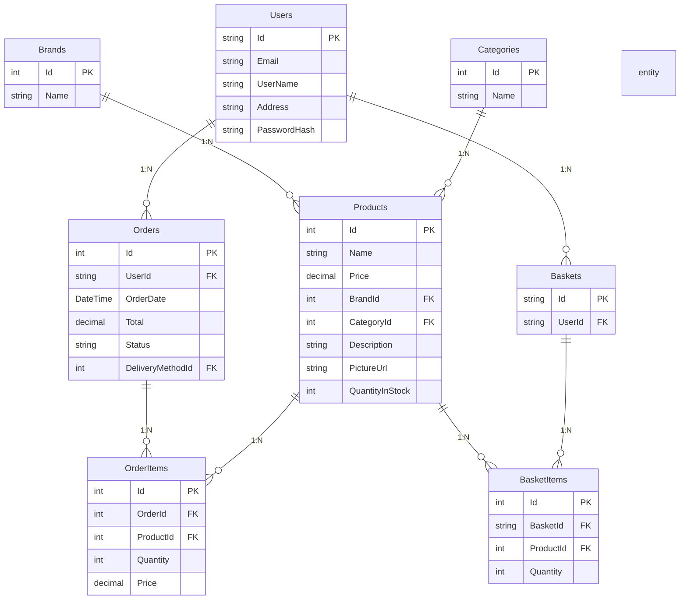
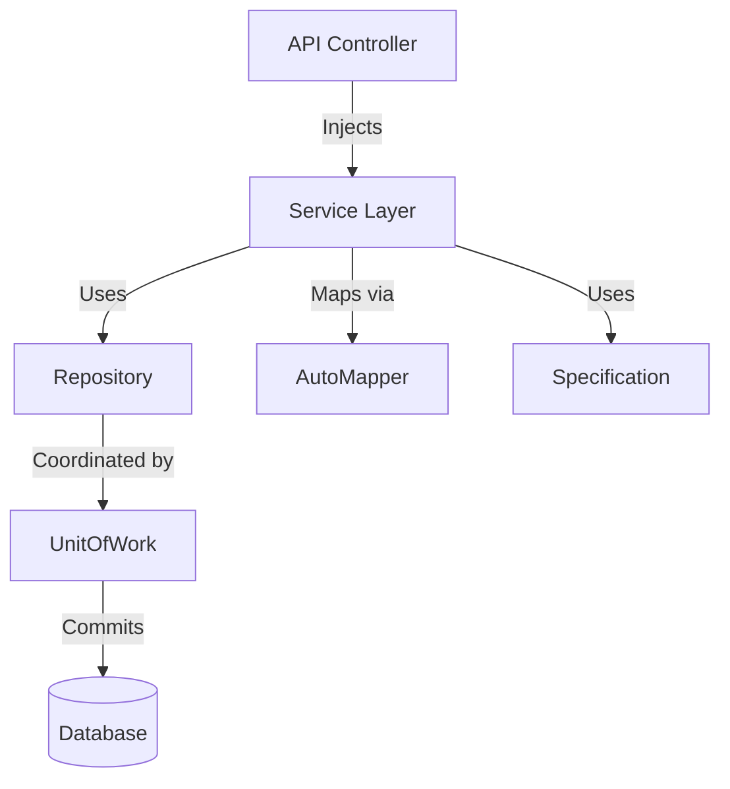

# Talabat API

## 📝 Project Overview

**Talabat API** is a robust e-commerce backend built with the latest architectural and design patterns, leveraging Clean Architecture and Onion Architecture to ensure scalability, maintainability, and clear separation of concerns.  
It utilizes Entity Framework Core, LINQ, and provides operations for product and order management, basket handling, user authentication, and payment integration.

### 👤 Who is it for?

Store owners, delivery companies, or any businesses aiming to launch a scalable e-commerce platform with inventory management, order processing, and payment features.

### ⚠️ Business Constraints

- Products with active orders cannot be deleted.
- Users with ongoing orders cannot be deleted.
- Baskets are deleted upon order completion or user request.
- Every order is associated with a single user and a delivery method.

---

## ✨ Key Features

- Product, category, and brand management.
- Shopping basket and order handling.
- JWT-based authentication and account management.
- Stripe payment integration.
- Health checks, logging, and Swagger API documentation.
- Clean/Onion Architecture with strict separation of concerns.
- Implementation of Repository, Unit of Work, and Specification patterns.

---

## 🛠️ Technical Stack and Dependencies

- **Backend**: ASP.NET Core (.NET 8)
- **Database**: SQL Server (Entity Framework Core)
- **Redis**: For basket caching
- **Docker & Docker Compose**: For multi-service orchestration
- **Stripe**: Payment integration
- **Architecture**: Clean/Onion Architecture, Repository Pattern, Unit of Work, Specification Pattern
- **Authentication**: JWT (JSON Web Tokens)
- **Swagger**: API documentation
- **AutoMapper**: DTO/entity mapping

---

## 🗂️ Solution Structure

```plaintext
src/
├── Talabat.APIs/           # Presentation layer: API controllers, application configuration
├── Talabat.Core/           # Domain entities, interfaces, business logic
├── Talabat.Repository/     # Data access implementations (repositories, UoW, EF Core)
├── Talabat.Services/       # Business services, integrations (Stripe, Redis, etc.)
```

**Layers explained:**
- **Talabat.APIs**: API controllers, middleware, error handling, configuration.
- **Talabat.Core**: Domain models/entities, repository & service interfaces, core logic.
- **Talabat.Repository**: Implements repositories, Unit of Work, and DB context.
- **Talabat.Services**: Business logic services, external integrations.

---

## 🗺️ Entity Relationship Diagram (ERD)



---

## 📡 API Endpoints (Selected Examples)

### AccountController
- `POST /api/account/login`: Log in a user
- `POST /api/account/register`: Register a new user
- `GET /api/account`: Get the current user
- `GET /api/account/address`: Get the user's address
- `PUT /api/account/address`: Update the user's address
- `GET /api/account/emailexists`: Check if an email exists
- `PUT /api/account/update`: Update the user's information
- `PUT /api/account/updatepassword`: Update the user's password

### BasketController
- `GET /api/basket`: Get a basket by ID
- `POST /api/basket`: Update a basket
- `DELETE /api/basket/id`: Delete a basket by ID

### ErrorsController
- `GET /errors/{code}`: Handle errors

### OrderController
- `POST /api/order`: Create a new order
- `GET /api/order`: Get orders for the current user
- `GET /api/order/{id}`: Get an order by ID
- `GET /api/order/deliveryMethods`: Get delivery methods

### ProductsController
- `GET /api/products`: Get a list of products
- `GET /api/products/{id}`: Get a product by ID
- `GET /api/products/brands`: Get a list of product brands
- `GET /api/products/categories`: Get a list of product categories

---

## 🏗️ Design Patterns Overview

### 1. Repository Pattern
**Pattern overview:**  
Abstracts the data access layer, allowing business logic to interact with repositories instead of database-specific code.

**Implementation:**
- All data queries and updates are handled in repository classes under Talabat.Repository, implementing interfaces defined in Talabat.Core.

**Example:**
```csharp
public interface IProductRepository
{
    Task<Product> GetByIdAsync(int id);
}
```

---

### 2. Unit of Work Pattern
**Pattern overview:**  
Combines multiple repository operations under a single transaction for atomic commits.

**Implementation:**
- The UnitOfWork class manages the DbContext and all repositories, exposing a single Commit method.

**Example:**
```csharp
_unitOfWork.OrderRepository.Add(order);
await _unitOfWork.Complete();
```

<details>
<summary>Sample Unit of Work Implementation</summary>

```csharp
public interface IUnitOfWork : IDisposable
{
    IProductRepository ProductRepository { get; }
    IOrderRepository OrderRepository { get; }
    Task<int> Complete();
}

public class UnitOfWork : IUnitOfWork
{
    private readonly StoreContext _context;
    public IProductRepository ProductRepository { get; }
    public IOrderRepository OrderRepository { get; }

    public UnitOfWork(StoreContext context,
                      IProductRepository productRepository,
                      IOrderRepository orderRepository)
    {
        _context = context;
        ProductRepository = productRepository;
        OrderRepository = orderRepository;
    }

    public async Task<int> Complete()
    {
        return await _context.SaveChangesAsync();
    }

    public void Dispose()
    {
        _context.Dispose();
    }
}
```
</details>

---

### 3. Specification Pattern
**Pattern overview:**  
Encapsulates business rules and query logic into reusable, composable objects.

**Implementation:**
- Specifications are used to build complex queries (filtering, sorting, includes, etc.) for entities.

**Example:**
```csharp
var spec = new ProductsWithBrandsAndTypesSpecification(productId);
var product = await _productRepository.GetEntityWithSpec(spec);
```

<details>
<summary>Sample Specification Implementation</summary>

```csharp
public class ProductsWithBrandsAndTypesSpecification : BaseSpecification<Product>
{
    public ProductsWithBrandsAndTypesSpecification(int id)
        : base(p => p.Id == id)
    {
        AddInclude(p => p.Brand);
        AddInclude(p => p.Category);
    }
}
```
</details>

---

### 4. Dependency Injection (DI)
**Pattern overview:**  
Services and repositories are injected via constructors, not manually instantiated.

**Implementation:**
- All services, repositories, and DbContext are registered in `Program.cs` or `Startup.cs`.

**Example:**
```csharp
public ProductsController(IProductService productService, IMapper mapper) { ... }
```

---

### 5. AutoMapper
**Pattern overview:**  
Automates mapping between domain entities and DTOs/ViewModels.

**Implementation:**
- Mappings are configured in profile classes and used throughout controllers and services.

**Example:**
```csharp
var productDto = _mapper.Map<Product, ProductDto>(product);
```

---

#### 🔎 Visual Summary



---

## 🚀 Installation and Running the Project

1. **Clone:**
   ```bash
   git clone https://github.com/MostafaElmarakpy/Talabat-API.git
   cd Talabat-API
   ```

2. **Docker:**
   ```bash
   docker-compose up --build
   ```

3. **Local Run:**
   - Update connection strings in `appsettings.json`
   - Run the project:
     ```bash
     dotnet restore
     dotnet run --project Talabat.APIs
     ```

---
